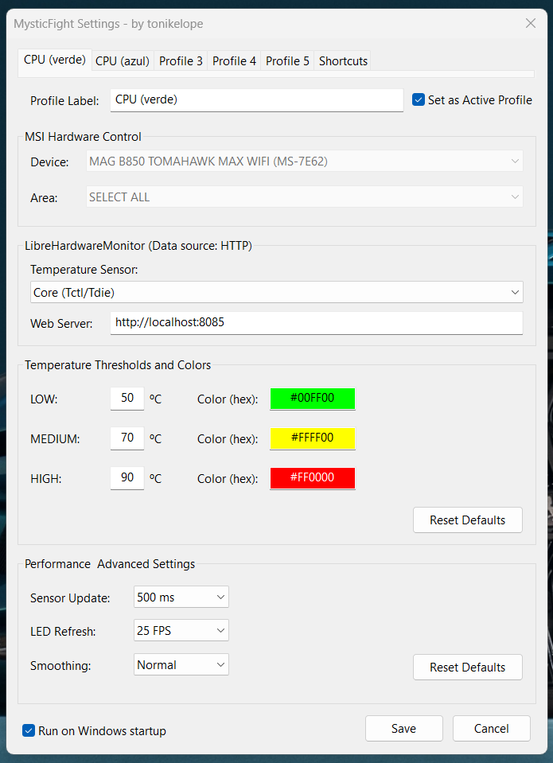
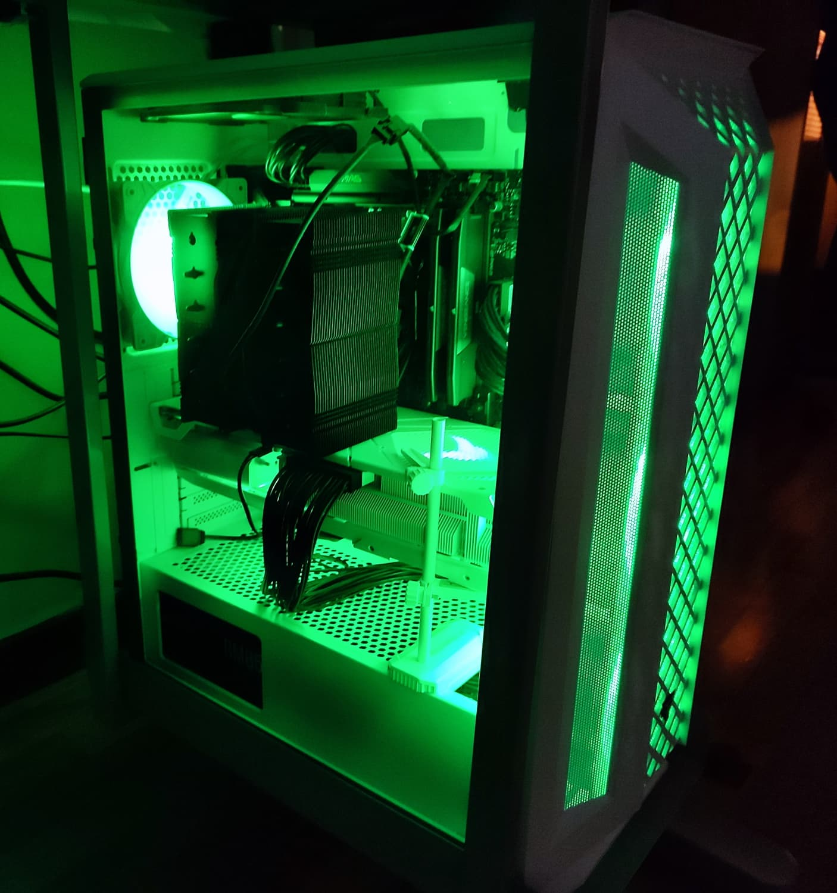

# MysticFight

MSI Mystic Light Temperature Profile Replacement.

## ❓ Why MysticFight?
Let's be honest: the official **Mystic Light** software is often unreliable, and "fails more than a fairground shotgun". 

The main issue with Mystic Light CPU temperature profile: **it fails randomly after a system reboot**, forcing you to manually open MSI Center and navigate to the Mystic Light section every single time just to get it working again. It seems that they fix it in one update but break it in the next, in a endless loop. This is simply intolerable. 

Fortunately, while Mystic Light "client" is a mess, people who programmed the **SDK** actually did a good job. **MysticFight** bypasses the buggy MysticLight interface and talks directly to the SDK.

## Features
* **Real-time Monitoring:** Temperature tracking via HTTP.
* **VERY Lightweight:** No heavy dashboards; just a simple tray app that stays out of your way.
* **Customizable Device and LED area:** Choose the one you prefer. <i>Please note that MSI Mystic Light SDK may not recognise all areas available on your device (you will have to wait for MSI to update the public SDK)</i>.
* **Customizable Temperature Sensor:** Choose the one you prefer.
* **Customizable Temperature and Colors Thresholds:** RMS interpolation.
* **5 profiles settings:** You can set a custom shortcut to change between profiles.
* **Night-Mode with Global Hotkey:** You can set a custom shortcut to power-off/on LEDs.
  

  
## ⚠️ Requirements
For this tool to work, you MUST have the following installed/running:

1. **MSI Center:** [Download here](https://www.msi.com/Landing/MSI-Center). (Just installed, its not required to load with Windows. But remember you must install and enable the **Mystic Light** module inside it to provide the underlying drivers for SDK).
   * Disable **both** options in Mystic Light config: overwrite third part RGB and power saving mode. (It is highly recommended to also disable automatic updates for MSI Center and Mystic Light).
2. **LibreHardwareMonitor:** [Download here](https://github.com/LibreHardwareMonitor/LibreHardwareMonitor/releases/download/v0.9.4/LibreHardwareMonitor-net472.zip). Must be running (minimized on tray) to provide temperature data via Web Server (You must enable Remote Web Server in LHM options menu). <i>Note: Yes, I know there is a LibreHardwareMonitorLib available, but I don't have the time or inclination to mess around with CLR DLL wrappers such when LHM client works perfectly well for this task, is lightweight and useful for other popular monitoring applications such as RainMeter</i>.

